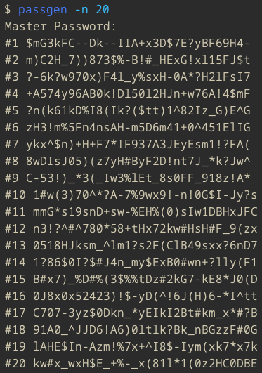

# Simple password generator



## Build

```
$ make
```

## Usage

```
$ ./passgen
$ ./passgen -n 10   // number of passwords: ≥ 1
$ ./passgen -l 32   // length of password: 8 ≤ length ≤ 32
$ ./passgen -o      // print only one last password
```