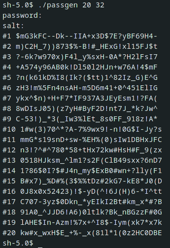
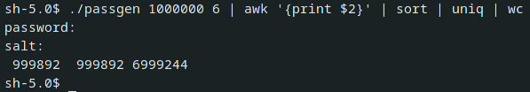

# Simple password generator

Generating a password list based on the one password:



Example of passwords collisions:



## Build

````
$ make
````

## Usage

````
$ ./passgen
$ ./passgen 20 // count of passwords ≥ 1
$ ./passgen 20 32 // length of password, 1 ≤ length ≤ 32
$ ./passgen 20 32 -l // only the last password
````

## Restrictions of prompts

````
0 ≤ salt ≤ 41
````
